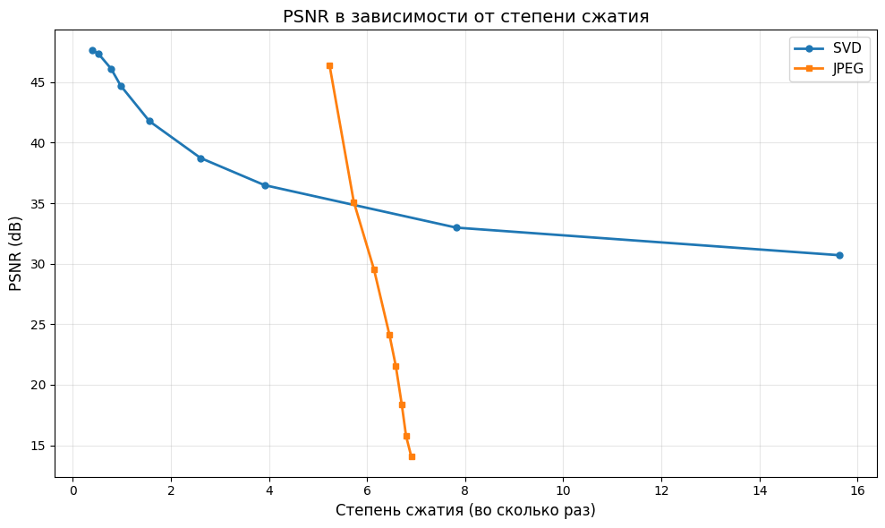
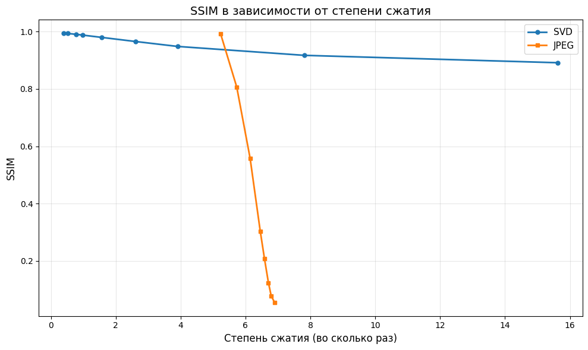
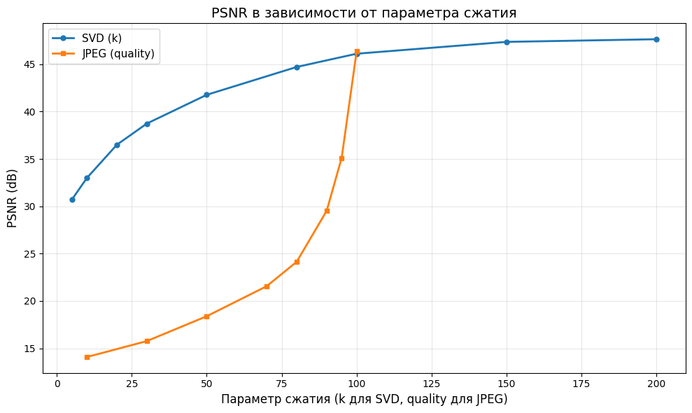
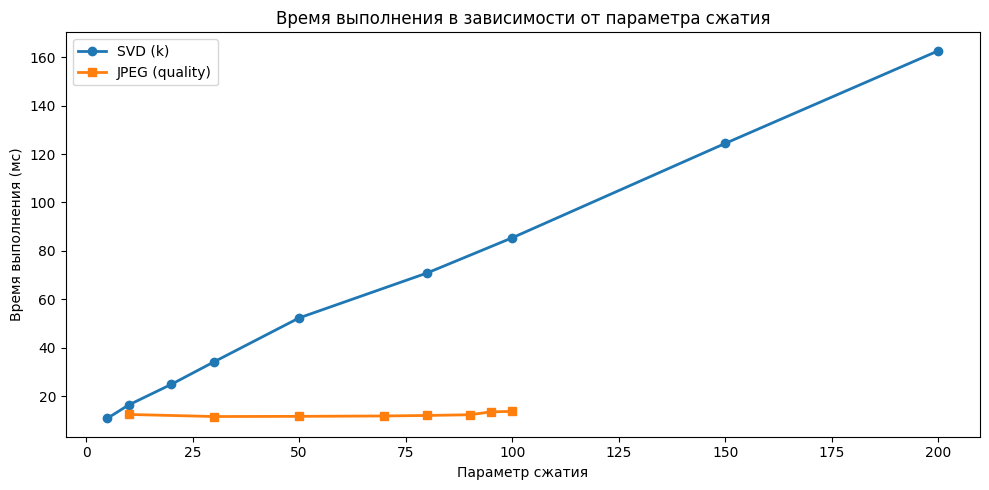
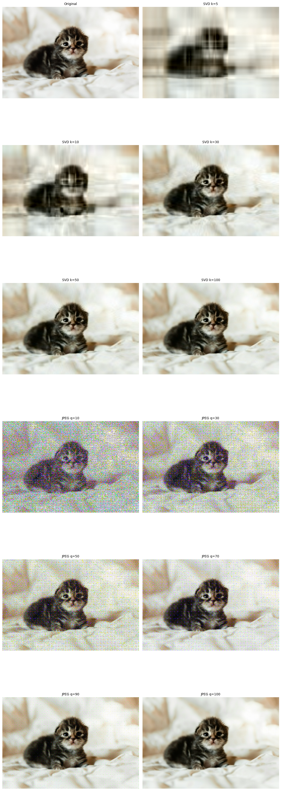

## О проекте

Данный проект представляет собой анализ сравнения двух подходов к сжатию изображений:
*   **Стандартный JPEG** — алгоритм сжатия с потерями, основанный на дискретном косинусном преобразовании (DCT), квантовании и энтропийном кодировании.
*   **Сжатие на основе SVD** — метод аппроксимации изображения с использованием сингулярного разложения матрицы, где качество регулируется количеством сохранённых сингулярных чисел (рангом).
**Цель:** Сравнить эти два метода по следующим составляющим:
*   Коэффициент сжатия (размер выходного файла).
*   Качество восстановленного изображения (PSNR, SSIM).
*   Визуальные артефакты при низких параметрах сжатия.
*   Вычислительная сложность.
Поддерживаются многоканальные изображения (приводятся к YCbCr). Реализованы метрики качества **PSNR** и **SSIM** для объективного сравнения исходного и восстановленного изображений.
## Структура репозитория

.  
├── jpeg/ # Модуль сжатия JPEG
├── svd/ # Реализация сжатия через SVD (поиск компонент, rank-k приближение)  
├── compare/ # Вычисление метрик (PSNR, SSIM) для многоканальных изображений  
├── auxiliary/ # Вспомогательные функции (чтение BMP, работа с матрицами и т.д.)  
├── sample/ # Анализ результатов с таблицей (csv)
├── Makefile # Файл сборки всех компонентов  
├── ava.bmp # Пример тестового изображения (можно заменить)  
└── README.md

## Сборка
```bash
В корневой директории проекта выполните:

make

Если нужна очитска:

make clean
```
## Метрики качества

### PSNR 

Показывает отношение максимально возможной мощности сигнала к мощности шума, искажающего изображение.

- **Чем выше PSNR (в dB), тем лучше качество** восстановления.
- Обычно значения > 30 dB считаются хорошим качеством, > 40 dB — отличным.

### SSIM 

Оценивает структурное сходство между исходным и восстановленным изображениями.

- **SSIM ближе к 1.0** - изображения очень похожи.
- **SSIM ближе к 0.0** -  изображения сильно отличаются.

В проекте используется многоканальная версия SSIM и PSNR, вычисляемая для каждого цветового канала (Y, Cb, Cr) с последующим усреднением.

## Оценка степени сжатия

### JPEG-метод

Так как результат сохраняется в BMP (несжатый формат), размер файла не отражает реальную степень сжатия. Поэтому изображение сохраняется в формате .jpg, а при необходимости просмотра восстанавливается в прежний формат. Это гарантирует практическое (честное) сжатие. 

Степень сжатия = Оригинальный размер изображения / Размер сжатого изобр.

### SVD-метод

Для rank-k аппроксимации изображения размера `width × height` сохраняются:

- `k` левых сингулярных векторов (по `width` значений)
- `k` правых сингулярных векторов (по `height` значений)
- `k` сингулярных чисел

**Формула оценки:**

Сохранено значений ≈ $k * (width + height + 1)$
Коэффициент сжатия = $(width * height) /$ сохранено_значений
## Результаты

Для тестового изображения `sample/ava.bmp` (417x626) были получены следующие результаты:

| Метод    | Параметр | Сжатие  | PSNR  | SSIM  | Время (мс) |
| -------- | -------- | ------- | ----- | ----- | ---------- |
| **SVD**  | k = 5    | 15.63:1 | 30.70 | 0.891 | 11.08      |
| **SVD**  | k = 50   | 1.56:1  | 41.77 | 0.979 | 51.59      |
| **JPEG** | q = 95   | 5.74:1  | 35.11 | 0.807 | 13.03      |
| **JPEG** | q = 100  | 5.24:1  | 46.39 | 0.991 | 16.64      |

#### 1. Качество сжатия (PSNR vs Степень сжатия)

На графике видно, что SVD обеспечивает более плавное ухудшение качества при увеличении сжатия. В планах это доработать, т. к. де-факто JPEG-сжатие должно иметь похожую на SVD зависимость.

#### 2. Структурное сходство сжатия (SSIM vs Степень сжатия)


#### 3. Зависимость степени сжатия от значения параметра

#### 4. Производительность

JPEG работает стабильно, SVD замедляется с ростом качества.

#### 5. Примеры сжатых изображений


#### **Вывод:** 

При выбранных параметрах JPEG-подобный метод показывает хуже качество восстановления (меньше PSNR и SSIM) из-за артефактов на границах блоков, хотя обеспечивает более высокую степень сжатия.  Выбор метода зависит от приоритета: качество изображения или минимизация размера.
## Текущие ограничения

На данный момент программа поддерживает:

- Только BMP-файлы **без сжатия** (несжатые).
- Только **24-битные BMP** (YCbCr).
- Результат JPEG сохраняется в .jpg, но .jpg визуально не соответствует исходной картинке, так как сохранение битов изобр. расходится со стандартом.
- Реализация SVD не оптимизированная (используется Якоби (медленно)).

## Планы по доработке

- Добавить поддержку разных форматов изображений.
- Очистить код от отладочных выводов.
-  Сделать выходные .jpg используемыми (полезно), либо хранить сырые биты (не соответствует стандарту, но сжатие может быть мощнее).
-  Использовать QR-алгоритм для SVD.
-  Исправить артефактирование на границах блоков при JPEG-сжатии для улучшения качества при малых quality, сделать таблицу квантования менее агрессивной.
